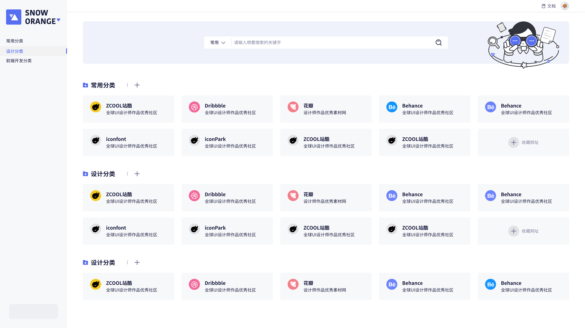
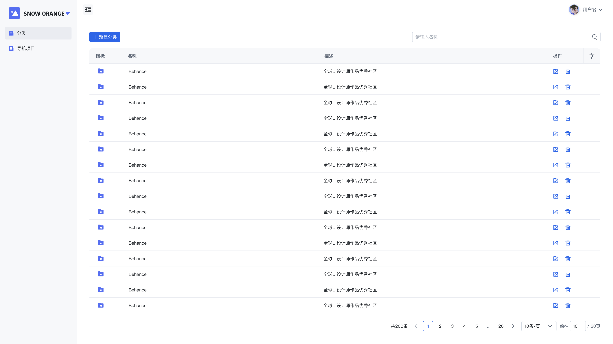
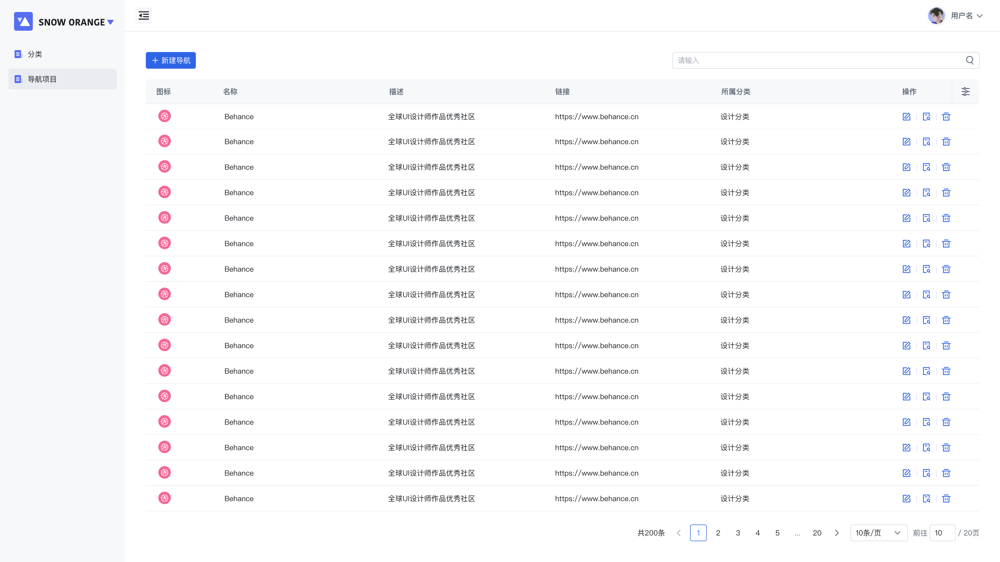

# StartPage
**StartPage** is a start page for your browser.




## Features


### Categories

Create and manage different categories to organize your websites efficiently.




### Sites
Add, edit, and remove your favorite websites within each category.



### User Management
Manage user's accounts.


## Getting Started

This is this the frontend of the project. You can find the backend [here](https://github.com/huangcheng/startpage-server).

### Installation
1. Clone the repository:
```bash
git clone https://github.com/huangcheng/startpage-web.git
```

2. Install dependencies:
```bash
npm install
```
Or
```bash
pnpm install
```

3. Copy the `.env.example` file to `.env` and make sure the `API_URL` is correct, if you were encountered `CORS`, consider using Nginx to proxy the request.

4. Build the project:
```bash
npm run build
```
Or
```bash
pnpm run build
```

5. Deploy the `dist` folder to your web server.


## License
The designer of the project is [huqinxue](https://github.com/huqinxue)
